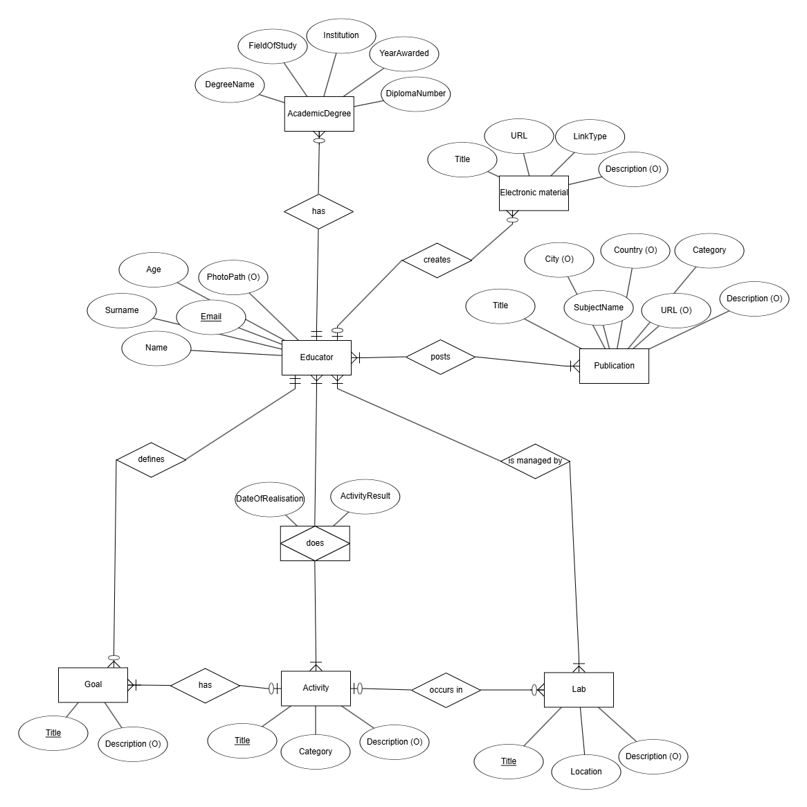
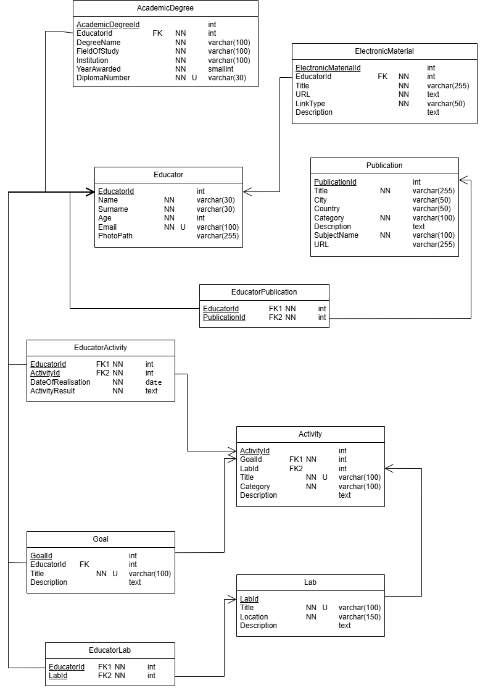

# Database-Oriented-Academic-System
Simplified structured database system that supports knowledge transfer

## Project Overview

Information Technology for Knowledge Transfer project focuses on creating effective didactic methods and a prototype system for transferring acquired knowledge into practical application using modern Information and Communication Technologies (ICT).

The system is designed to support pedagogical processes with the aim of improving the efficiency of time usage for both students and educators when transferring the latest scientific knowledge into academic subjects and subsequently into the knowledge and skills of graduates entering professional practice.

The database system enables:

* management of educators and their qualifications

* tracking of publications and electronic learning materials

* definition of research and educational goals

* organization of activities and experiments

* management of laboratories and academic collaboration

## Entity-Relationship Diagram

The system includes several supporting entities:

- **AcademicDegree** – stores academic qualifications of educators (*DegreeName, FieldOfStudy, Institution, YearAwarded, DiplomaNumber*).
- **ElectronicMaterial** – represents digital educational materials such as lesson notes or links to online lectures (*Title, URL, LinkType, Description*).
- **Publication** – contains scientific or professional publications created by educators (*Title, City, Country, Category, SubjectName, URL*).
- **Goal** – defines research or educational objectives within the project (*Title, Description*).
- **Activity** – represents specific tasks performed by educators to achieve goals (*Title, Category, Description*).
- **Lab** – represents laboratories or spaces where activities and experiments take place (*Title, Location, Description*).

Together, these entities form the core database structure that enables management of educators, their qualifications, educational activities, and contributions to knowledge transfer in the academic environment.

## Relational model

## Entity Relationships

The database uses several relationships between entities to model academic activities and knowledge transfer processes.

- **Educator – AcademicDegree (1:N)**  
  One educator may have multiple academic degrees, while each degree belongs to exactly one educator.

- **Educator – ElectronicMaterial (1:N, optional)**  
  An educator may create multiple electronic materials, but materials can also remain in the system even if the educator is removed.

- **Educator – Publication (M:N)**  
  Implemented through the **EducatorPublication** table.  
  An educator may have multiple publications, and a publication may have multiple authors.

- **Educator – Goal (1:N)**  
  One educator may define multiple goals related to teaching or research.

- **Educator – Activity (M:N)**  
  Implemented through the **EducatorActivity** table.  
  Multiple educators may participate in a single activity.

- **Educator – Lab (M:N)**  
  Implemented through the **EducatorLab** table.  
  Educators may manage multiple laboratories, and laboratories may be managed by multiple educators.

- **Goal – Activity (1:N)**  
  Each goal may consist of multiple activities, while every activity must belong to a specific goal.

- **Activity – Lab (optional)**  
  Activities may take place in laboratories, but some activities (e.g., online workshops) may occur without a lab.

These relationships enable the system to manage educators, academic activities, publications, materials, and laboratories within a structured knowledge transfer environment.